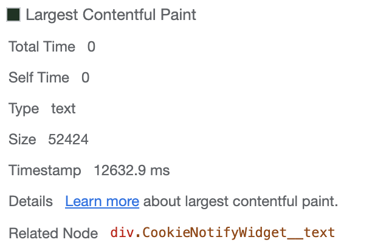

# **Анализ открытия сайта с использованием Chrome DevTools**
## **1. Network*

### **_1.1 Профиль загрузки ресурсов при открытии страницы_**

[HAR архив](./Network/www.gd.ru.har)

### **_1.2 Неоптимальные места_**

**_1.2.1 Дублирование ресурсов_**

- 1cont.ru

- bootstrap.bundle.min.js, bootstrap.min.css, bootstrap.min.js

- cast_sender.js

- code.js

- data:image/png;base...

- fontawesome-webfont.woff2?v=4.7.0

- jquery-3.5.1.js

- popper.min.js

- system_gd-logo

- user-recognition

**_1.2.2 Лишний размер ресурса_**

- JS файлы с большим весом

base.js: 767kB - transferred over network, 2.4MB - resource size
common.js: 389kB - transferred over network, 1.4MB - resource size
community.js: 383kB - transferred over network, 1.4MB - resource size

- Шрифты с большим весом

- CSS файлы с большим весом

fonts.css: 255kB - transferred over network, 339kB - resource size

- IMG файлы с большим весом

**_1.2.3 Медленно загружающиеся ресурсы_**

Были выбраны запросы с длительностью > 200ms

**_1.2.4 Ресурсы, блокирующие загрузку_**

Были выбраны запросы, начало которых произошло до этапа загрузки страницы First Paint

**_1.2.5 Что-то еще_**

- Заблокированные запросы
  
  
  

- Запросы со статусом 302, которые привели к лишним запросам по новым адресам
  

## **2. Performance**

### **_2.1 Профиль загрузки страницы_**

[Profile.json](./Performance/Profile.json)

### **_2.2 Время от начала навигации до событий:_**

- **First Paint - 577.2 ms**

- **First Contentful Paint - 577.2 ms**

- **Largest Contentful Paint - 758.9 ms**

- **DOMContentLoaded Event - 2.0 s**
- **Event - 2.79 s**

### **_2.3 DOM-элемент, на котором происходит LCP_**

### **_2.4 Времени, которое тратится на разные этапы обработки документа_**

- **Loading - 34 ms**
- **Scripting - 266 ms**
- **Rendering - 156 ms**
- **Painting - 15 ms**

## **3. Coverage**

### **_3.1 Скриншот вкладки после загрузки страницы_**

### **_3.2 Объём неиспользованного CSS в ходе загрузки страницы в килобайтах_**

- **Unused CSS - 564 kB**

### **_3.3 Объём неиспользованного JS в ходе загрузки страницы в килобайтах_**

- **Unused JS - 2.3 MB**

# **Анализ при замедлении CPU 4x slowdown и эмуляции сети Slow 3G**

## **1. Network**

### **_1.1 Профиль загрузки ресурсов при открытии страницы_**

[HAR архив](./SlowNetwork/www.gd.ru-slow.har)

### **_1.2 Неоптимальные места_**

Всё тоже самое, что и при первом тесте, только дольше.

## **2. Performance**

### **_2.1 Профиль загрузки страницы_**

[Profile-slow.json](./SlowNetwork/Profile-slow.json)

### **_2.2 Время от начала навигации до событий:_**

- **First Paint - 9460.1 ms**

- **First Contentful Paint - 9460.1 ms**

- **Largest Contentful Paint - 12632.9 ms**

- **DOMContentLoaded Event - 27162.9 ms**

- **Event - 51.55 s**

### **_2.3 DOM-элемент, на котором происходит LCP_**

### **_2.4 Времени, которое тратится на разные этапы обработки документа_**

- **Loading - 366 ms**
- **Scripting - 13244 ms**
- **Rendering - 4718 ms**
- **Painting - 739 ms**

## **3. Coverage**

Всё то же самое, что и при первом тесте

